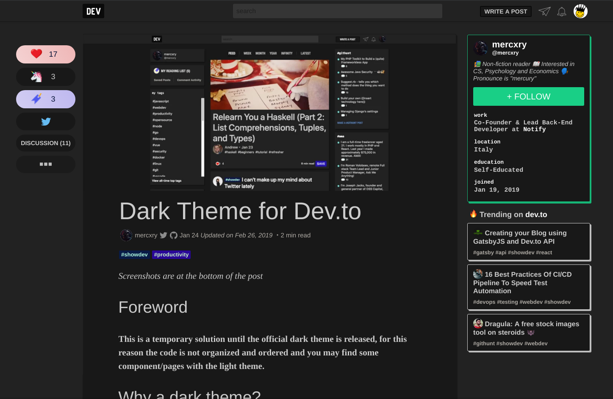
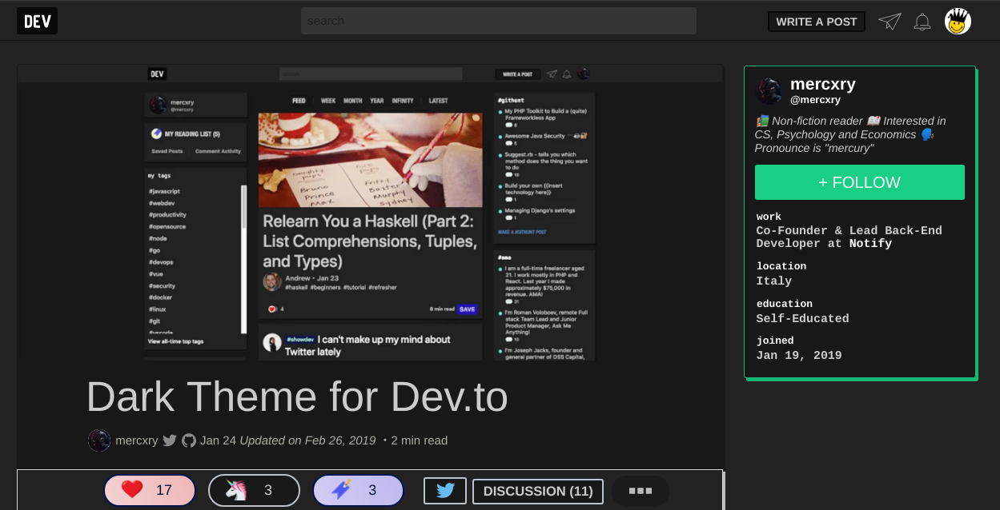
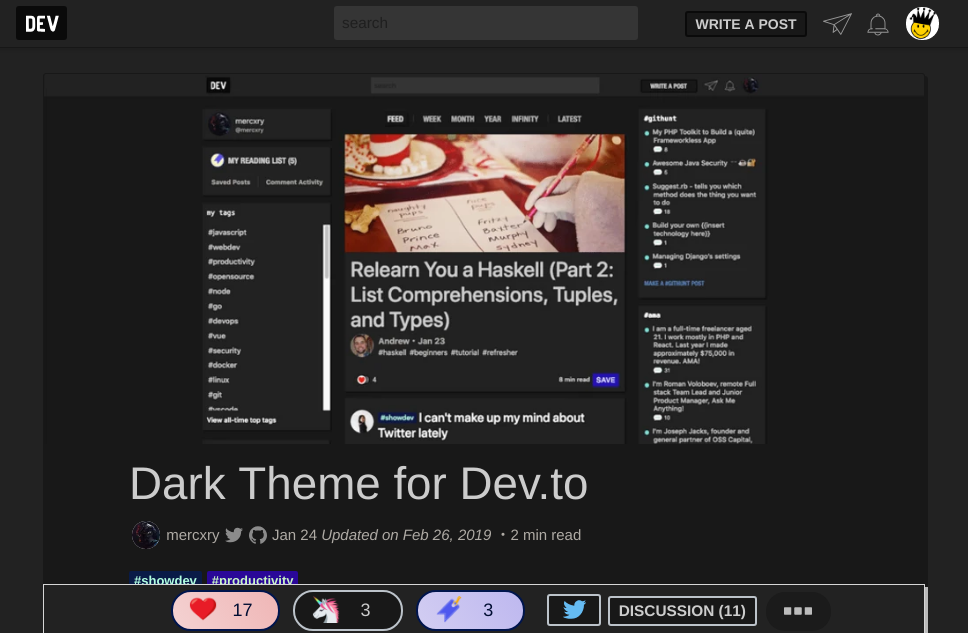

# Dev.to - Dark Theme

## Disclaimer

This theme was created for fun over a weekend, the code is very messy and without documentation, but you can still enjoy contributing.

## Useful Links

-   **Official Post:** https://dev.to/mercxry/dark-theme-for-devto-14e9
-   **UserStyles:** https://userstyles.org/styles/168140/dev-to-dark-mode

## Screenshots

